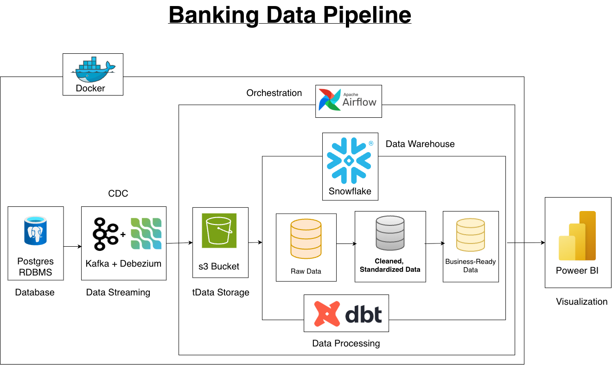

# Banking Data Pipeline

An end-to-end banking data engineering and analytics project that captures transactional changes from PostgreSQL, streams them through Kafka and Debezium, lands the data in object storage, transforms it in Snowflake using dbt, and delivers business insights through Power BI.

---

## Table of Contents

- [Executive Summary](#-executive-summary)
- [Business Problem](#-business-problem)
- [Methodology](#-methodology)
- [Data Model](#data-model)
- [Skills Demonstrated](#-skills-demonstrated)
- [Results & Business Recommendations](#-results--business-recommendations)
- [Recommendations](#recommendations)
- [Next Steps / Challenges / Limitations](#-next-steps--challenges--limitations)

---

## 📌 Executive Summary

This project demonstrates a complete data pipeline for a simulated banking environment, from operational data generation to business reporting.

The pipeline starts with a PostgreSQL banking database containing customers, accounts, cards, merchants, and transactions. Changes to the source data are captured via Debezium and Kafka, enabling the pipeline to implement Change Data Capture (CDC).

The streaming data is landed in an S3-compatible MinIO bucket before being loaded into Snowflake. dbt is then used to clean, standardize, test, and transform the data into a dimensional model consisting of fact and dimension tables.

The final data model is connected to Power BI via Microsoft Fabric to provide a banking analytics dashboard that covers transaction performance, merchants, account distribution, transaction trends, and payment channels.

The project focuses on demonstrating both **data engineering fundamentals and business-facing analytics** rather than simply building a dashboard.

---

## 🧩 Business Problem

Banks generate large volumes of transactional and customer data across multiple operational systems. Without a structured data pipeline, this information can be difficult to consolidate, transform, and use for decision-making.

This project addresses the following business questions:

- How much transaction value and transaction activity is being generated?
- What is the overall transaction success rate?
- Which merchants generate the highest transaction value?
- How is the customer base distributed across account types?
- How does successful transaction activity vary across calendar months?
- Which payment channels handle the highest number of high-value transactions?
- How can operational changes be captured and propagated through the data platform?

The goal is to create a reliable analytical layer that allows business users to answer these questions without querying the operational database directly.

---

## 🔬 Methodology

### Architecture

The pipeline follows this flow:

**PostgreSQL → Debezium + Kafka → MinIO → Snowflake → dbt → Power BI**

### Data Generation

Synthetic banking data was generated using Python and Faker to simulate:

- Customers
- Accounts
- Cards
- Merchants
- Transactions

The generated data was stored in PostgreSQL, representing the operational banking database.

### Change Data Capture

Debezium monitors the PostgreSQL database and captures changes to source records.

Kafka acts as the streaming layer between the operational database and downstream storage.

This allows the project to demonstrate CDC rather than relying only on full batch reloads.

### Data Landing

Kafka events are consumed and written to an S3-compatible MinIO bucket.

MinIO acts as the landing layer before the data enters the warehouse.

### Data Warehouse

Snowflake is used as the analytical data warehouse.

The data is organized into:

- Raw data
- Cleaned and standardized data
- Business-ready dimensional models

### Transformation

dbt is used to transform the Snowflake data into analytics-ready models.

The transformation layer handles:

- Data cleaning
- Standardization
- Deduplication
- Ranking/latest-record logic
- Dimension and fact creation
- SCD Type 2 handling for changing dimensional records
- Business metrics and analytical fields

### Orchestration

Apache Airflow is used to orchestrate the pipeline components and coordinate the movement and processing of data.

### Visualization

The final business-ready data is exposed through a Power BI semantic model in Microsoft Fabric.

The final dashboard provides an executive-level view of banking activity.

---

## Data Model

The warehouse follows a star schema with one central transaction fact table and supporting dimensions.

**FCT_TRANSACTIONS** — Transaction-level events containing transaction amount, status, payment channel, and foreign keys to customer, account, merchant, and date dimensions.

**DIM_CUSTOMERS** — Customer attributes including customer ID, demographics, income, employment type, and SCD Type 2 history.

**DIM_ACCOUNTS** — Account attributes including account type, status, balances, branch information, and loan-related attributes.

**DIM_CARDS** — Card attributes including card type, status, and contactless capability.

**DIM_MERCHANTS** — Merchant attributes including merchant category, channel, location, and online/offline status.

**DIM_DATE** — Calendar dimension supporting month, quarter, year, weekday, financial quarter, and time-based analysis.

The model follows a one-to-many relationship pattern from dimensions to the transaction fact table.

### SCD Type 2

SCD Type 2 was implemented for changing customer and account attributes, preserving historical versions rather than overwriting previous values.

The implementation was validated by introducing a source-level change and verifying that the previous and current dimension versions were retained with their respective validity periods.

---

## 📊 Final Dashboard

The final Power BI dashboard provides a single-page executive view of the banking data.

### Key Metrics

The dashboard currently reports:

- **31.26B** total transaction amount
- **250K** total transactions
- **91.94%** transaction success rate
- **9K** merchants
- **126K** contactless cards
- **3.58M** average spend per merchant

### Key Insights

**Merchant concentration**

Modern Manne Supermarket is the highest-spending merchant in the dataset at approximately **15.7M**, followed by Modern Virk Cafe and City Nair Supermarket.

**Account distribution**

Savings accounts represent the largest account segment at approximately **42%**, followed by Current, Salary, and Fixed Deposit accounts.

**Monthly transaction activity**

Successful transactions remain relatively stable across the calendar months, with February showing the lowest activity at approximately **17.9K** and January the highest at approximately **19.7K**.

This indicates that the synthetic dataset does not contain strong seasonal transaction patterns.

**Payment channels**

Mobile Banking handles the highest number of high-value transactions, followed by POS and UPI. Card transactions have the lowest volume among the channels shown.

---

## 🛠 Skills Demonstrated

**Data Engineering:** Python, PostgreSQL, Docker, Apache Kafka, Debezium, MinIO, Snowflake, Apache Airflow

**Data Transformation:** SQL, dbt, dimensional modelling, star schema, window functions, deduplication, SCD Type 2

**Analytics & BI:** Microsoft Fabric, Power BI, DAX, semantic modelling, KPI development, dashboard design

**Engineering Practices:** Git/GitHub, environment-based configuration, layered data architecture, pipeline orchestration

---

## 📈 Results & Business Recommendations

The completed pipeline successfully demonstrates the movement of banking data from an operational PostgreSQL database through a CDC-based streaming architecture into a cloud data warehouse and finally into a business intelligence layer.

The resulting analytical model supports both operational and business-level analysis.

The dashboard shows:

- Strong overall transaction activity with **250K transactions**
- **91.94% transaction success rate**
- Significant transaction value of approximately **31.26B**
- A relatively stable monthly transaction pattern
- Higher high-value transaction activity through Mobile Banking
- Savings accounts as the largest account segment
- Concentration of transaction spending among the leading merchants

These results suggest that transaction volume, payment-channel usage, merchant concentration, and account composition are useful areas for ongoing monitoring.

---

## Recommendations

Based on the current analysis:

- Monitor transaction success rate by channel and geography to identify operational issues early.
- Prioritize reliability and capacity monitoring for Mobile Banking given its high-value transaction volume.
- Monitor spending concentration among major merchants to understand commercial exposure.
- Track contactless adoption as an indicator of card usage behaviour.
- Introduce deeper customer segmentation using income, employment, account type, and transaction behaviour.

---

## 🚀 Next Steps / Challenges / Limitations

The project uses synthetic data, so the distributions do not necessarily represent real banking behaviour and some dimensions are relatively evenly distributed. The current transaction model also does not contain a direct Card Key relationship, limiting card-level transaction analysis.

Future iterations could introduce more realistic data-quality issues such as late-arriving events, duplicates, missing values, invalid reference keys, and transaction anomalies.

The pipeline could also be extended with incremental dbt models, automated data-quality testing, Kafka monitoring, CI/CD, cloud deployment, fraud/anomaly detection, customer segmentation, and deeper geographic and card-usage analysis.
